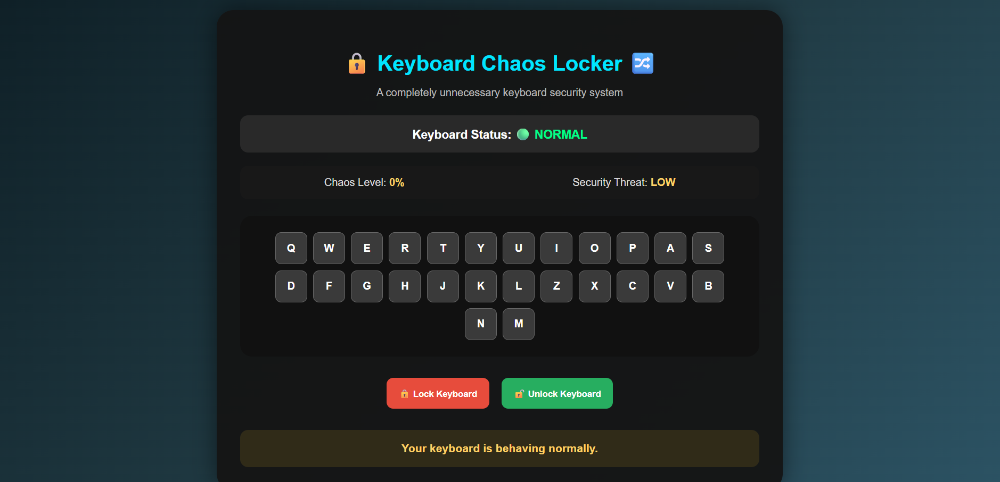
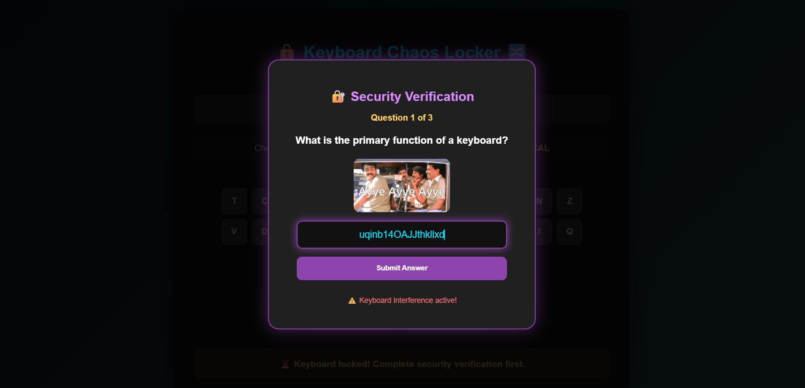
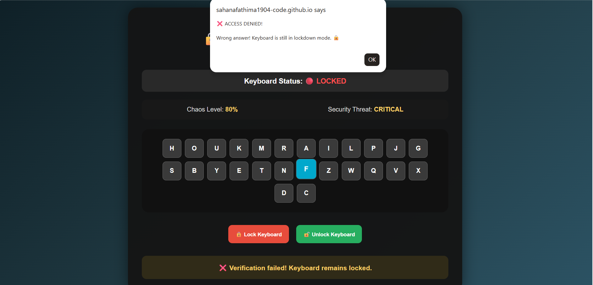
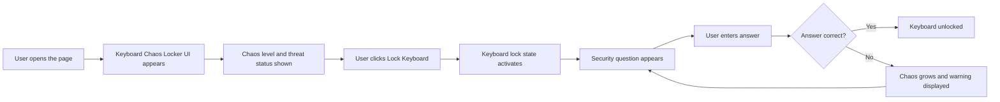

# keyNova

## Basic Details
### Team Name: logiclab

### Team Members
- Team Lead: Sahana Fathima P.A. - KMEA Engineering College


### Project Description
Keyboard Chaos Locker is a playful web-based keyboard security experience that turns a normal keyboard into a dramatic chaotic lock system. It visualizes keyboard status, security threat, and chaos level while locking the keyboard through a silly verification challenge.

### The Problem (that doesn't exist)
Keyboards are getting too confident. They type without asking, scatter letters across random chaos, and make every typo feel like a security breach. The world needs a ridiculous way to stop a keyboard from behaving like it owns the system.

### The Solution (that nobody asked for)
Keyboard Chaos Locker adds an over-the-top security layer where the keyboard is locked, shuffled, and protected by fake verification questions, random chaos levels, threat warnings, and a funny reaction GIF with sound. It turns a boring typing device into a dramatic chaos-control checkpoint for the brave user.

## Technical Details
### Technologies/Components Used
For Software:
- Languages used: HTML, CSS, JavaScript
- Frameworks used: None (plain static web project)
- Libraries used: Web Speech API, CSS animations
- Tools used: VS Code, Git, GitHub, Chrome/Browser

For Hardware:
- Main components: Computer, Keyboard, Audio output
- Specifications: Standard keyboard and browser-enabled system
- Tools required: VS Code, local web server, browser

### Implementation
For Software:
# Installation
```bash
git clone https://github.com/sahanafathima1904-code/useless_project_temp.git
cd Keyboard-Chaos-Locker
```

# Run
```bash
python -m http.server 8000
```
Then open <http://localhost:8000/index.html>.

### Project Documentation
For Software:

# Screenshots (Add at least 3)

*Hero view of the Keyboard Chaos Locker web interface showing the title, keyboard panel, status box, and action buttons.*


*Typing and keyboard panel demo showing the visual key layout used by the chaos locker experience.*


*Security verification window with a funny GIF, audio reaction, and lock-check question.*

# Diagrams

*Workflow diagram showing the keyboard locking, security question, answer validation, unlock, and chaos restart cycle.*

### Project Demo
# Video

[demo video](https://drive.google.com/file/d/1JQXQ4rok8MQsXAGOsMbLucuz4AwzYKWb/view?usp=sharing)

# Additional Demos
[live link](https://sahanafathima1904-code.github.io/useless_project_temp/)

## Team Contributions
- Sahana Fathima P.A.: Built the project structure, UI, documentation, and git setup,Contributed to the key UI and keyboard behavior style,Contributed to the project assets and UI polishing.

---
Made with love at TinkerHub Useless Projects 


